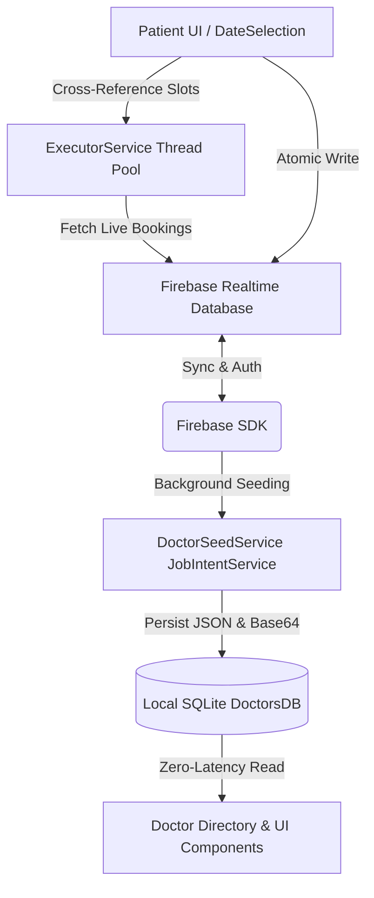

# 🩺 DoctorRank
### Smart Healthcare Discovery & Real-Time Doctor Appointment Booking System

[](https://developer.android.com)
[](https://www.java.com)
[](https://firebase.google.com)
[](https://www.sqlite.org)
[](https://developer.android.com)
[](https://developer.android.com)

*A robust, offline-first native Android healthcare application bridging patients and medical professionals through real-time schedule synchronization and intuitive appointment management.*


---
## 🛠️ Tech Stack

| Category | Technologies & Libraries |
| :--- | :--- |
| **Language** | Java 11 |
| **Platform** | Android SDK (Min API 34, Target API 36) |
| **UI Components** | XML Layouts, Material Design, Custom `ListView` Adapters, `ConstraintLayout`, `SearchView`, `CalendarView` |
| **Backend & Cloud** | Firebase Authentication, Firebase Realtime Database |
| **Local Persistence** | SQLite (`SQLiteOpenHelper`), Android `SharedPreferences` |
| **Serialization** | Google Gson (`libs.gson`) |
| **Asynchronous Processing** | `JobIntentService`, `ExecutorService`, `Handler`, `Looper` |


---


## 📖 Overview

**DoctorRank** is a modern, full-featured native Android application built to simplify the medical consultation process. Whether finding a top-rated cardiologist, checking real-time clinic schedules, or booking and managing appointments, DoctorRank delivers a seamless user experience.

Designed with **high performance and reliability** in mind, the application employs a hybrid **Cloud + Local Storage architecture**. It automatically synchronizes live doctor directories and schedule data from **Firebase Realtime Database** and caches them into a local **SQLite database** (`DoctorsDB`) via background services. This ensures instantaneous search results, zero browsing latency, and offline-capable directory exploration.

---

## ✨ Key Features

### 🔍 Smart Doctor Discovery & Filtering
- **Dynamic Doctor Directory:** Browse specialists ranked by patient ratings, medical qualifications, and specialties.
- **Real-Time Instant Search:** Filter doctors instantaneously by name, specialty, or qualification using the responsive `SearchView` adapter.
- **Detailed Profile View:** Access comprehensive doctor bios, BMDC registration numbers, consultation charges, room numbers, and complete weekly schedules.

### ⏱️ Real-Time Availability & Slot Verification
- **Interactive Calendar Booking:** Select consultation dates effortlessly using customized `CalendarView` pickers.
- **Dynamic Schedule Cross-Referencing:** Multi-threaded executor pools cross-reference the doctor's weekly routine against real-time Firebase bookings (`bookings/{doctorId}/{date}`) to dynamically separate **Available** vs. **Booked** time slots.
- **Atomic Booking Transactions:** Simultaneous two-way synchronization writes booking records to both doctor and patient directories (`user_bookings/{userId}`).

### 📅 End-to-End Appointment Lifecycle
- **Upcoming Appointments:** Track scheduled consultations with automatic filtering that hides expired dates.
- **Today's Appointments:** Dedicated quick-access dashboard for appointments taking place on the current day.
- **Past Consultation History:** Archive and review historical doctor visits and records.
- **Instant Cancellation Flow:** Seamlessly cancel appointments, releasing booked slots across the cloud in real time.

### 🔐 Security & Patient Profile Management
- **Firebase Authentication:** Secure email/password registration, login, and persistent session management (`rememberLogin`).
- **Profile Customization:** Comprehensive patient profiles supporting Base64-encoded image compression, personal details, and medical info updates.
- **Secure Password Updates:** Built-in account credential verification and update workflows.

---

## 🏗️ System Architecture & Highlights



- **Hybrid Caching Engine (`DoctorsDB` & `DoctorSeedService`):** To eliminate redundant network calls and prevent UI freezing, `DoctorSeedService` downloads complex doctor structures (including schedules converted via **Gson** and images converted to Base64) and persists them inside an optimized local SQLite schema.
- **Concurrency & Thread Safety:** All heavy network and database calls (slot loading, date parsing, image decoding) are offloaded from the main UI thread using `ExecutorService` single/multi-thread pools, safely marshaled back to the UI via `Handler` and `Looper.getMainLooper()`.

---

## 📱 Application Workflow

1. **Onboarding & Synchronization:** Upon launching (`Welcome.class`), the app verifies session states and triggers `DoctorSeedService` to silently update the local database with the latest doctor profiles from Firebase.
2. **Browse & Search:** In `MainActivity`, users browse top doctors or search specific symptoms/specialties with instant responsiveness.
3. **Select & Verify:** Choosing a doctor navigates to `DoctorProfilePage` for complete credential review, followed by `DateSelection` where live available time slots are fetched and validated.
4. **Confirm & Manage:** Once booked, users receive immediate confirmation (`confirmation.class`) and can track, view, or cancel visits anytime from the **Upcoming** or **Today's** dashboards.

---

## 📁 Project Structure

```text
app/src/main/java/edu/ewubd/doctorrank223410/
├── Welcome.java & MainActivity.java          # App Entry points & Dashboard navigation
├── LoginPage.java & RegisterPage.java        # Authentication workflows
├── DoctorProfilePage.java & DoctorsDB.java   # Specialist details & SQLite caching helper
├── DoctorSeedService.java                    # Background service syncing cloud data locally
├── DateSelection.java & Booking.java         # Slot scheduling & Firebase booking models
├── MyAppointments.java                       # Central hub for user consultations
├── UpcomingAppointment.java                  # Filtered view for future schedules
├── TodaysAppointment.java                    # Real-time dashboard for today's visits
├── PastAppointment.java                      # Historical log of previous consultations
├── CancelConfirmation.java & confirmation.java # Booking lifecycle confirmation screens
├── UserProfilePage.java & UpdatePass.java    # Account settings & security updates
└── *Adapters.java                            # Custom UI list view controllers
```

---

## 🚀 Getting Started

### Prerequisites
- **Android Studio** (Koala / Ladybug or newer recommended)
- **JDK 11+** installed
- An active **Firebase Project**

### Installation Steps

1. **Clone the Repository:**
   ```bash
   git clone https://github.com/your-username/DoctorRank.git
   cd DoctorRank
   ```

2. **Configure Firebase:**
   - Create a project on the [Firebase Console](https://console.firebase.google.com/).
   - Add an Android app with package name: `edu.ewubd.doctorrank223410`.
   - Enable **Firebase Authentication** (Email/Password).
   - Enable **Firebase Realtime Database** and set rules appropriate for your environment.
   - Download the generated `google-services.json` file and place it inside the `app/` directory:
     ```text
     DoctorRank/app/google-services.json
     ```

3. **Build and Run:**
   - Open the project in **Android Studio**.
   - Let Gradle sync dependencies automatically (`Check build.gradle.kts`).
   - Connect an Android device or start an emulator running **API Level 34+**.
   - Click **Run** (`Shift + F10`).

---

## 🔮 Future Enhancements
- 🔔 **Push Notifications:** Real-time reminder alerts 1 hour before scheduled consultation slots via Firebase Cloud Messaging (FCM).
- 💊 **Digital Prescription & Diagnosis Upload:** Ability for doctors to attach PDF/image prescriptions directly to a patient's appointment log.
- 💳 **Online Payment Gateway Integration:** Seamless pre-booking consultation fee payments via Stripe or SSLCommerz.
- 🗺️ **Hospital/Clinic Geolocation:** Integrated Google Maps navigation showing exact chamber locations.

---

## 👨‍💻 Author

**Nura Alam Naim**   
**Arham Jawad Akib**  
